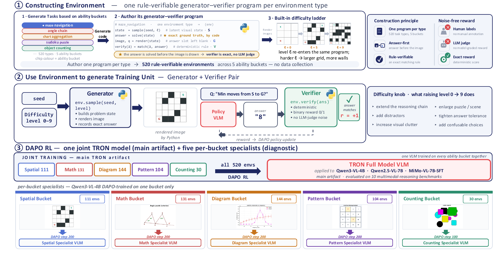

# TRON: Targeted Rule-verifiable Online eNvironments

Environment code release for the paper
**"TRON: Targeted Rule-Verifiable Online Environments for Visual Reasoning RL"**.

**Authors:** Tianze Yang\*, Yucheng Shi\*, Ruitong Sun, Jingyuan Huang, Ninghao Liu, Jin Sun

**Affiliation:** School of Computing, University of Georgia, Athens, GA, USA

<sub>\* Equal contribution.</sub>

---



TRON is a suite of **520 procedurally generated visual reasoning environments**.
Each environment is a generator–verifier pair: the generator samples a fresh
latent visual state, renders an image, and constructs a question; the verifier
checks the model's answer against the deterministic ground truth derived from
the same state. There is no fixed dataset — each call produces a new instance.

The figure above sketches the full pipeline: (1) **Constructing Environment** —
authors write one rule-verifiable generator–verifier program per environment;
(2) **Generate Training Unit** — at training time, each environment is invoked
with a seed and a difficulty level to produce a fresh `(image, question,
answer)` triple, which is scored by the verifier; (3) **DAPO RL** — the same
520-environment substrate trains both a single **full TRON model** and five
**per-bucket ability specialists**.

## Suite composition (5 ability buckets)

| Bucket            | # envs | Core mechanisms                                                        |
| ----------------- | -----: | ---------------------------------------------------------------------- |
| `spatial`         |   111  | 3D rotation, cube nets & folding, navigation, perspective shifts       |
| `math`            |   131  | Geometry (angles/circles/polygons), analytic geometry, algebra, prob.  |
| `diagram`         |   144  | Charts, tables, graph algorithms, flowcharts, scientific figures       |
| `pattern`         |   104  | Constraint puzzles, visual analogies, sequences, state-space planning  |
| `count`           |    30  | Visual enumeration, path counting, measurement & feature estimation    |
| **Total**         | **520**|                                                                        |

The bucket membership for every environment is listed in [`buckets/`](buckets/)
(one `*.txt` file per bucket, one environment name per line).

## Repository layout

```
TRON/
├── environments/             # 520 env modules + base classes + helpers
│   ├── __init__.py           #   registry: ENVIRONMENTS[name] -> class, BUCKET[name] -> bucket
│   ├── standalone_base.py    #   base class (generate / get_prompt / verify)
│   ├── base.py               #   compatibility shim re-exporting from standalone_base
│   ├── _template_lib.py      #   prompt template utilities
│   ├── _mcq_letter_lib.py    #   MCQ option helpers
│   ├── _mcq_letter_helper.py
│   ├── _render_modes.py      #   render-mode (sketch / textbook) selection
│   └── <520 env modules>.py
└── buckets/
    ├── spatial.txt
    ├── math.txt
    ├── diagram.txt
    ├── pattern.txt
    └── count.txt
```

## Quick start

Dependencies: Python ≥ 3.9, `matplotlib`, `Pillow`, `numpy` (any modern version).

```python
from TRON.environments import ENVIRONMENTS, BUCKET

# Instantiate one environment
env = ENVIRONMENTS["aquarium_grid"]()

# Generate a fresh instance.  `parameter["level"]` is the difficulty (0-9).
env.generate(seed=42, parameter={"level": 3})

# Get the (image, question) pair fed to the VLM. The prompt also tells the
# model which answer wrapper to use for this particular instance.
image, question = env.get_prompt()         # image: PIL.Image, question: str

# Score a model output. Pass the raw model response — verify() locates the
# answer using the wrapper assigned to this seed.
result = env.verify(model_output)
# -> {"reward":  1.0, "format_score": 1, "accuracy": 1}   correct
# or {"reward": -0.5, "format_score": 1, "accuracy": 0}   wrong
# or {"reward": -1.0, "format_score": 0, "accuracy": 0}   malformed output
```

### Answer wrappers

Each instance is deterministically assigned one of three answer wrappers
based on the seed (so a training run sees all three formats, but each
individual prompt asks for exactly one):

1. `<answer>X</answer>`
2. `\boxed{X}`
3. `Final answer: X` (on the last line)

`env.get_prompt()` includes the wrapper instruction for the current seed
in the question text. `env.verify()` is **strict**: it only accepts the
wrapper that was requested — using the wrong wrapper counts as a format
error, even if the underlying answer is numerically correct. This is
intentional, to teach format obedience during RL training.

### Iterate over a bucket

```python
from TRON.environments import ENVIRONMENTS, BUCKET

for env_name, bucket in BUCKET.items():
    if bucket == "spatial":
        env = ENVIRONMENTS[env_name]()
        env.generate(seed=0, parameter={"level": 0})
        image, prompt = env.get_prompt()
        ...
```

### Difficulty ladder

Every environment exposes ten difficulty levels (`level=0` through `level=9`).
`level=0–2` are introductory; `level=8–9` are the hardest. The same generator
program is responsible for producing instances at every level — there is no
separate "easy" vs "hard" code path beyond what the level parameter controls.

## Reproducing the paper's training set

The paper trains on a uniform mixture over the 520 environments listed in
`buckets/*.txt`. To rebuild the canonical training pool, instantiate each
environment, draw `N` seeds per level, and emit `(image, prompt, answer)`
rollouts via `env.generate(seed, {"level": L})` + `env.get_prompt()` /
`env._answer`. Rewards during RL come from `env.verify(model_output)`.

## Full release

This repository contains the **environment code** only. The complete RL
training pipeline and the trained model checkpoints (full model + the five
per-bucket ability specialists) will be released upon paper acceptance.

## License

Released for research use. See the paper for full details on data sources,
intended use, and limitations.
